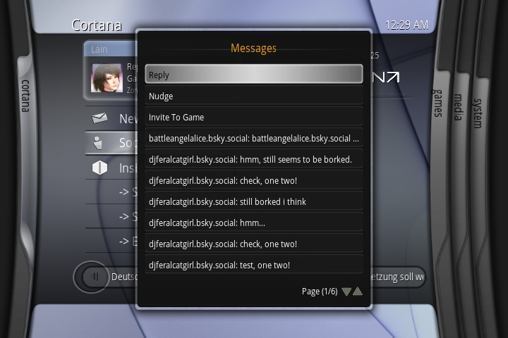
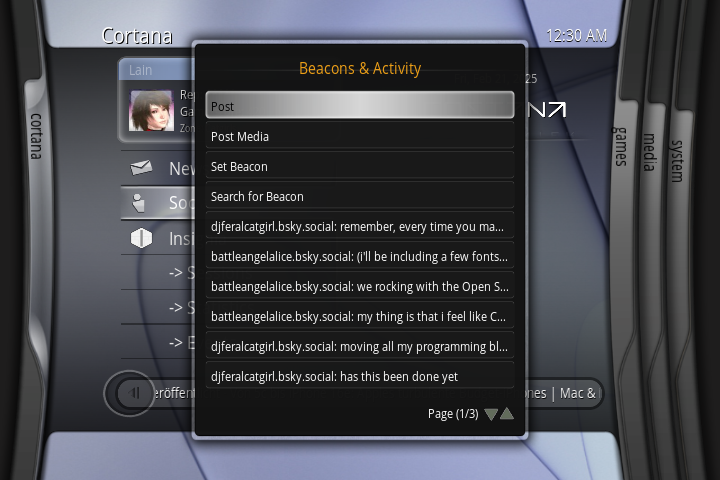
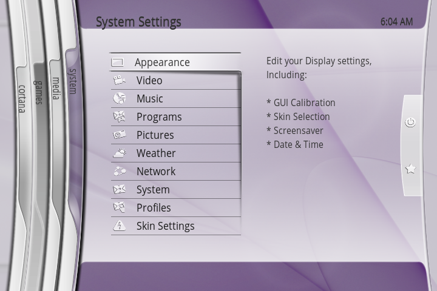

# cortanaOS - A modern, sleek "Xbox 180" style theme for XBMC4Xbox, with an emphasis on social / multiplayer feature integration.
## Requires [Cortana Server Browser](https://github.com/faithvoid/script.cortanaserverbrowser), [Cortana Chat](https://github.com/faithvoid/script.cortanachatv2), [Cortana Wireless (optional)](https://github.com/faithvoid/script.cortanawireless) & [xSky](https://github.com/faithvoid/plugin.programs.xSky) to function correctly!

## Menu Screenshots:

## Cortana Server Browser:

## Cortana Chat

## Themes
### Aero (WIP)

### Aero Lite (WIP)

## Features:
- Replaced the broken Weather page with **Cortana**, a series of scripts that allows you to view & join active Insignia/XLink Kai sessions, events, view server statistics, get new match notifications, get Cortana/Insignia/XLink Kai news, check your Insignia DNS settings, send/receive messages, and more!

- Get social on your Xbox again! Using **Cortana Chat**, you can use the AT protocol (aka Bluesky) to chat with fellow gamers, invite them to games, set beacons to find other players, and more, as well as quick access to Xbox Video Chat for voice/video chat over Insignia!

- Show off your gamerscore and reputation with **Cortana ID**, a reimplementation of gamertags from MC360! Set it manually, or pull it from your Xbox Live profile manually (or automatically on startup)!

- Paired with **Cortana Wireless**, you can easily connect a Raspberry Pi or similar SBC as a wireless network card for your Xbox and easily manage your Wi-Fi settings!

- **Per-profile save games and social features!** Share your Xbox with friends and family? Everyone gets their own accounts and saves!

- **"Guide button"** feature that reimplements most of the features you know and love from the 360, using Cortana Chat! Just click in the right stick and you have full access to social features, matchmaking features, media controls, settings, and more!

- **Toast notifications** for messages and notifications via Cortana Chat, and toast notifications for current XLink Kai / Insignia sessions via Cortana Server Browser!
  
- **Added quality-of-life functions to the Applications page** (Renamed certain items to seem more "official", added "Addons" & "Scripts" buttons, "Dashboard" button, "Xbox Live" (Network Settings) button, and "Detach Virtual Disk").
  
- **Added quality-of-life functions to the Media page** (added Video/Music/Photo add-ons!), as well as watched media indicators that were missing from the original JX 720!

- Use **Cortana Marketplace** to quickly download homebrew games & emulators! If stored in a .zip/.rar file, Cortana Marketplace will automatically extract the homebrew to your Homebrew folder so you can instantly hop into the action!
  
- Neon wallpapers have been swapped out for pastel abstract shapes (based off of old macOS 9 wallpapers), making the UI easier on the eyes.

- Multiple open-source font options for accessibility, with the primary font now being changed to Open Sans for better readability on smaller screens!
    
- Need to fix something? **cortanaOS Settings Menu** has you covered! With shortcuts to the **Dashboard, Internet Connection Test utilities, Notification Settings, Clear Cache, XBMC4Gamers Scripts, Updates,** and more, cortanaOS can help you out of most pickles!

## How to install:
- Download latest release from the Releases category (if there isn't a release .zip, do NOT clone this skin from GitHub and expect support! The repo is ALWAYS under development so things may be broken even if most features work, especially script-related functionality!)
- Copy "Cortana" to "Q:\skins\"
- Change your skin to Cortana in the XBMC Appearance menu.
- ???
- Profit!

## TODO (High Priority)
- Fix wallpaper memory usage bug.
- Fix up & release Cortana Server Browser & Cortana Chat.
- Reincorporate gamertag and media buttons from MC360 into guide menu somehow.

## TODO (Low-Med Priority):
- Further work on "Cortana Marketplace" (need to find a futureproof source for Xbox homebrew and possibly convert it from a script into an add-on for image previews)
- Fix multi-user savegame script.
- Work on "Aero" and "Aero Lite" themes (Aero Lite requires the most work, as the font colour system needs to be re-done to render fonts and their shadows correctly, Aero is basically done).
- Maybe make a menu option modification script(?)
- Change references from "Cortana" to "cortanaOS"

## Bugs:
- Cortana blade is currently a bit visually glitchy and visibly says "Refresh" when switching pages. It's a "blink and you'll mix it" issue but it's still present.
- Signing in to Cortana Chat can currently hang the system when launching a game right as the script refreshes. Looking into a fix for this ASAP before release.
- You tell me.

## Credits:
- Steve Matteson - Open Sans font
- Jezz_X & Team Blackbolt - JX720 & MC360, respectively (this project uses JX720 as a base, with MC360 assets reincorporated where possible)
